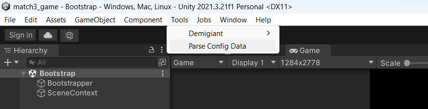
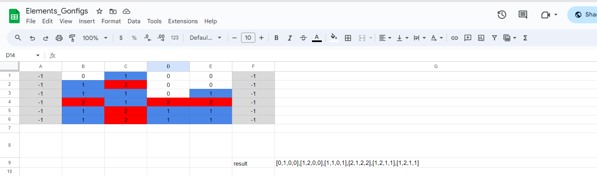
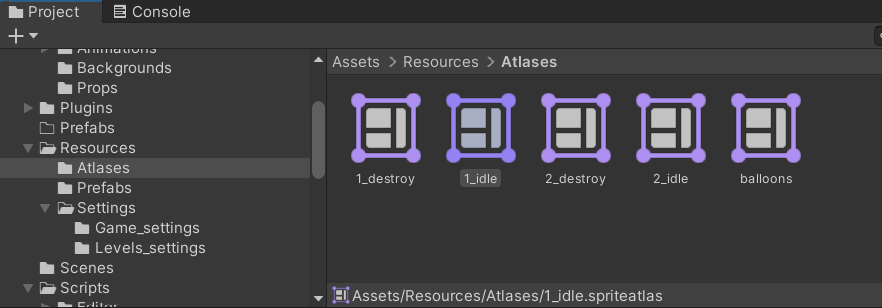

## Описание игры
[Описание логики игры](https://docs.google.com/document/d/1r_etmd5GP6zvcBz2rrBD00BJja40N7MOOfiTt5Uya3U/edit)  
[apk link](https://drive.google.com/file/d/17yQgU1LZP8lzdBgEYZGCSSEyxRLWWzht/view?usp=sharing)

### Механика игры
Механика игры напоминает игру в жанре match-3.
[Ссылка на игру Elements](https://play.google.com/store/apps/details?id=com.openmygame.games.android.swipeelements&hl=ru)

### Видео

[Ссылка на видео с геймплеем Elements](https://www.youtube.com/watch?v=q98GUf6Lrro)

### Версия Unity
Версия Unity: 2021.3.21f1

### Фреймворки
Для разработки игры использовались следующие фреймворки:
- Dotween
- Zenject
- UniTask

### Настройки игры
Настройки игры хранятся в Google Sheets [табличке](https://docs.google.com/spreadsheets/d/1B1AhAkfZluJcorIZh1skIPyfZ7cg30Axm7J9KE39lWg/edit#gid=0). Для её парсинга необходимо использовать вкладку **Tools => Parse config data** в главном меню Unity.

В табличке представлены следующие разделы:
- **Levels_settings**: хранятся настройки уровней.
- **Game_settings**: настройки игры.
- **Constructor**: используется для визуального конструирования новых уровней.

### Добавление новых блоков
Для добавления нового блока в игру необходимо:
1. Добавить спрайты для анимации блока.
2. Создать атлас в папке **Resources\Atlases**.
3. Название атласа должно соответствовать следующему формату: `{index_cube}_destroy` и `{index_cube}_idle`. Например, `1_destroy` и `1_idle` - это блок для водного элемента.

